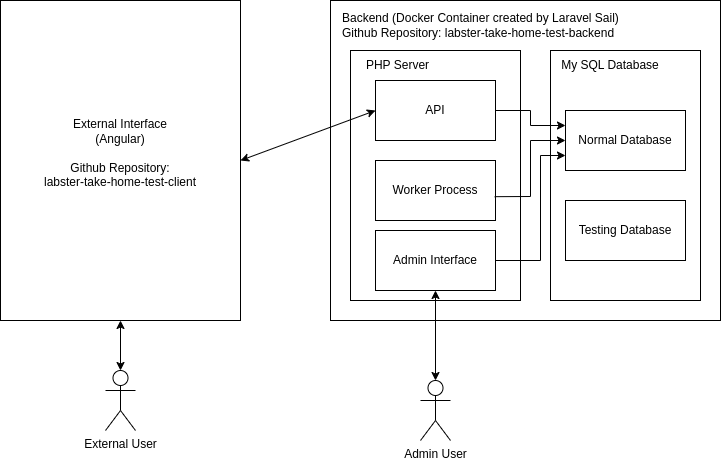
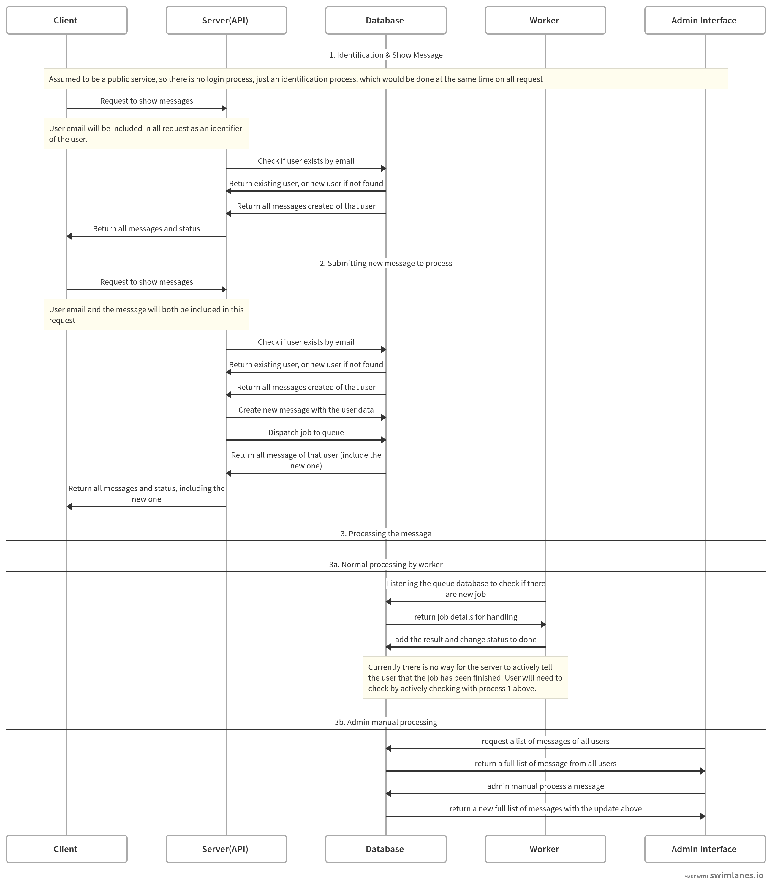

# Message System Prototype

## Requirement Assumptions
Considering this is just a prototype for the messenging service which won't be running on any external server, no login system is not added. Different users are identified by email with no password requirement.

## System Overview
The diagram below is an overview of the whole system.

 As shown in the diagram, this project is separated into 2 parts. This repoisitory is the backend (the right) part. For the external interface (the left part), please check [this repository](https://github.com/cytsunny/labster-take-home-test-client)

## System Dataflow

## Set Up
For the set up of front end, please check the [frontend repository](https://github.com/cytsunny/labster-take-home-test-client).

### Prerequisite

#### 1. PHP 8.2+ and Composer 2+
Laravel 11 is used in this project and it requires PHP8.2+ and composer 2+ to be installed.

#### 2. Docker and Docker Compose
Laravel Sail is used in this project, so docker and docker-compose is needed You may follow the [Official Docker Guide](https://docs.docker.com/engine/install/) and [Official Docker Compose Guide](https://docs.docker.com/compose/install/)

### Steps to Set Up
1. Open your command prompt and navigate to the project folder
2. Run `composer install`
3. Make sure port 80 and 3306 are not occupied.
4. Run `./vendor/bin/sail up`
5. You should see the docker container being set up and run. Open another command prompt window and navigate to the project folder
6. Run `cp .env.local .env` to set up environment variables with the preset settings
7. Run `./vendor/bin/sail artisan migrate` to set up the database
8. Open a browser and input navigate to http://localhost/user-message and you should see the Message System Admin page with no message.
9. Optional: run `./vendor/bin/sail artisan queue:listen` to have the worker running. If this is not run, message will only be processed when the admin click the button on admin page.
10. Head over to [frontend repository](https://github.com/cytsunny/labster-take-home-test-client) to set up the client.

### Testing
After running setp 1-6, you may run the following to run the test. 

`./vendor/bin/sail artisan test --coverage`

Currently as there are no complicated logic in this project, only integration test is added.